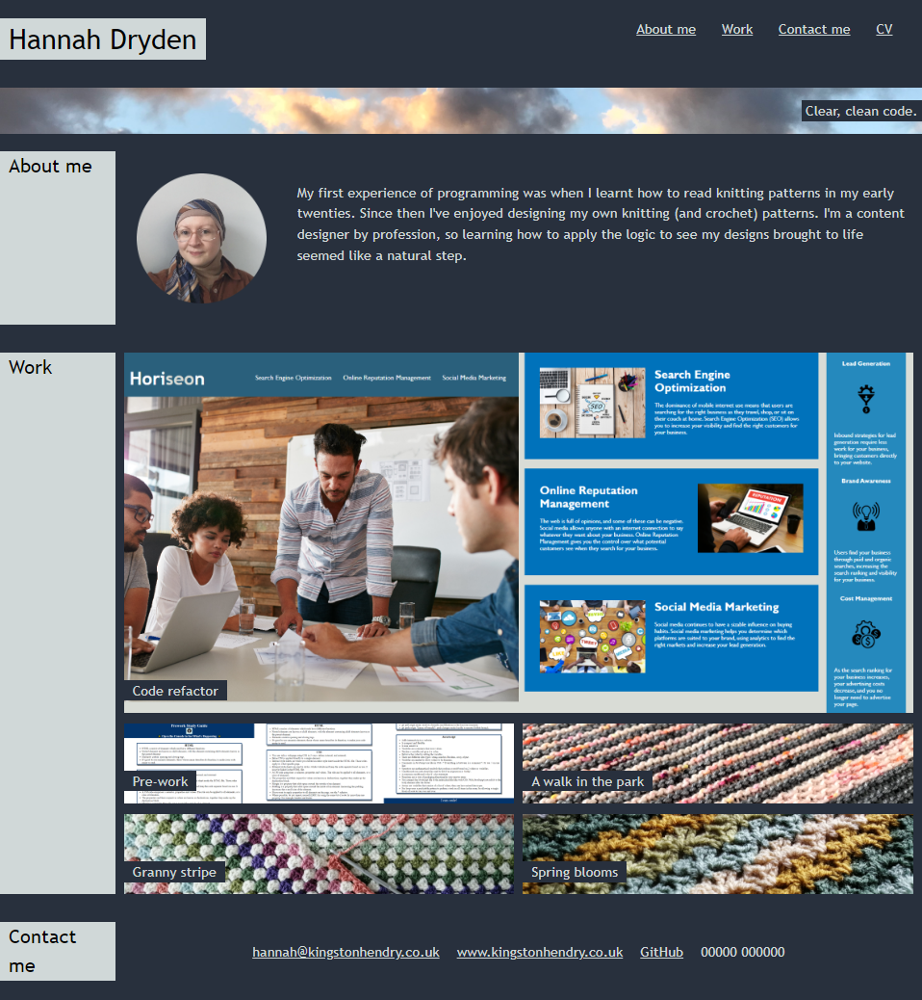
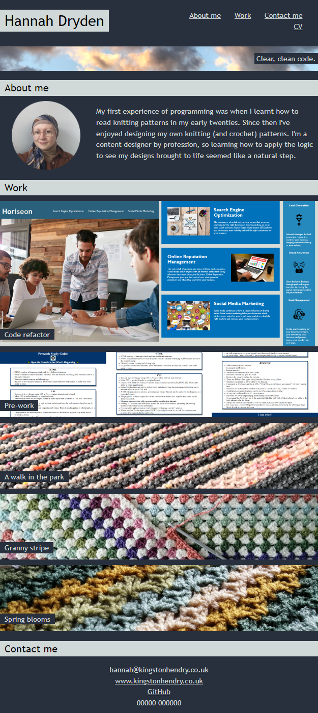

# 2-portfolio
## Description

The purpose behind this project was to create a portfolio page using the skills I've learnt to date in HTML and CSS. Some particular features include:
- menu links jump to the relevant section
- labels are overlaid on top of images
- my profile picture links to LinkedIn
- my 2 projects link to the deployed applications
- all links open in a new tab
- the design is responsive

## Installation

N/A

## Usage

[Deployed application](https://hannah-kh.github.io/2-portfolio/).

If you inspect the page you can view the HTML and CSS and see how it works.

Desktop view:

Mobile view:

## Credits

N/A

## License

Refer to the LICENSE in the repo.

---

